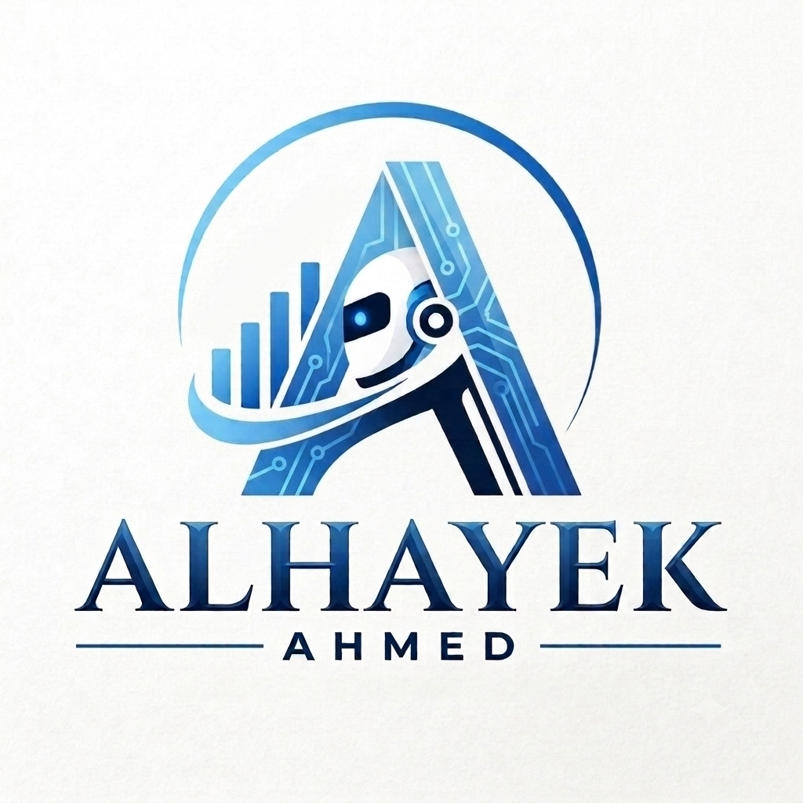

<h1 align="center">🚀 Alhayek Academy - أكاديمية الحايك</h1>


<div align="center">
  
  <br />
  <strong>أتقن فن هندسة الأوامر | Master Prompt Engineering</strong>
  <br /><br />
  
  
  
  
  
  
  
</div>

---

## 📖 عن المشروع

**Alhayek Academy** هي منصة تعليمية تفاعلية تهدف إلى تعليم **هندسة الأوامر (Prompt Engineering)** بطريقة متسلسلة ومنهجية، مع دعم كامل للغتين العربية والإنجليزية.

تم تصميم المنصة لتكون:
- 🎯 **سهلة الاستخدام** و**تفاعلية** لتناسب جميع المستويات.
- 🌍 **ثنائية اللغة** (العربية والإنجليزية) للوصول إلى أكبر عدد من المتعلمين.
- 📱 **متجاوبة** مع جميع الأجهزة (جوال، جهاز لوحي، حاسوب).

### 🎯 الهدف

تمكين المتعلمين من صياغة أوامر احترافية لنماذج الذكاء الاصطناعي (مثل ChatGPT، Claude، Gemini) من خلال:
- ✅ 5 مراحل تعليمية متسلسلة.
- ✅ شرح نظري مع أمثلة عملية.
- ✅ تدريبات تفاعلية.
- ✅ اختبارات مع تصحيح فوري.
- ✅ حاسبة التوكنز لتحسين استهلاك الموارد.
- ✅ لوحة تحكم متقدمة لمتابعة التقدم.
- ✅ شهادة إنجاز قابلة للمشاركة.

---

## ✨ الميزات الرئيسية

| الميزة | الوصف |
|--------|-------|
| **5 مراحل تعليمية** | من الأساسيات إلى الاحتراف، كل مرحلة تحتوي على شرح وتدريب واختبار. |
| **دعم ثنائي اللغة** | التبديل الفوري بين العربية والإنجليزية بكل سلاسة. |
| **خلفية 3D تفاعلية** | جسيمات متحركة وشعار ثلاثي الأبعاد باستخدام Three.js. |
| **حاسبة التوكنز** | تقدير عدد التوكنز، الكلمات، الأحرف، والتكلفة التقريبية. |
| **لوحة تحكم** | متابعة التقدم، أداء المراحل، وتوصيات للتحسين. |
| **شهادة إنجاز** | شهادة قابلة للتحميل (PDF) والمشاركة على لينكدإن. |
| **تخزين محلي** | حفظ التقدم في المتصفح (LocalStorage). |
| **تصميم متجاوب** | يعمل على جميع الأجهزة (جوال، جهاز لوحي، حاسوب). |
| **Glassmorphism** | تصميم عصري بشفافية وتأثيرات زجاجية. |

---

## 🏗️ الهيكل التنظيمي للمشروع

```
prompt-engineering-academy/
├── index.html                  # الصفحة الرئيسية
├── css/
│   ├── style.css              # التصميم الأساسي
│   ├── 3d-overlay.css         # تنسيق الـ 3D
│   └── certificate.css        # تنسيق الشهادة
├── js/
│   ├── main.js                # التشغيل الرئيسي
│   ├── stages.js              # نظام المراحل
│   ├── quiz.js                # نظام الاختبارات
│   ├── token-calc.js          # حاسبة التوكنز
│   ├── i18n.js                # نظام الترجمة
│   ├── progress.js            # إدارة التقدم
│   ├── certificate.js         # نظام الشهادة
│   ├── linkedin-share.js      # مشاركة لينكدإن
│   ├── dashboard.js           # لوحة التحكم
│   ├── three-setup.js         # إعداد الـ 3D
│   ├── particle-system.js     # نظام الجسيمات
│   ├── scene-manager.js       # إدارة المشاهد
│   └── interactions.js        # التفاعلات 3D
├── data/
│   ├── content-ar.json        # المحتوى العربي
│   └── content-en.json        # المحتوى الإنجليزي
└── assets/
    ├── images/
    │   ├── logo-alhayek.png      # شعار الموقع
    │   ├── logo-alhayek-hero.png # شعار الصفحة الرئيسية
    │   ├── signature-placeholder.png # توقيع المدرب
    │   └── qr-placeholder.png # QR Code للشهادة
    ├── fonts/                 # الخطوط المخصصة
    └── icons/                 # الأيقونات
```

---

## 🎨 الهوية البصرية

### الألوان المعتمدة

| اللون | الكود | الاستخدام |
|-------|-------|-----------|
| الأزرق المتوسط | `#0077B6` | الأزرار والروابط الرئيسية |
| الأزرق الداكن | `#25538A` | الخلفيات والعناوين الكبيرة |
| الأزرق الساطع | `#0096C7` | التفاعلات والتأكيدات |
| الأزرق العميق | `#3780BF` | العناصر الثانوية |
| الأزرق السماوي | `#90E0EF` | النقاط المميزة والإضاءات |
| الأزرق الفاتح | `#6FB7E0` | الخلفيات الفاتحة |
| الأبيض | `#FFFFFF` | النصوص الأساسية |

### الخطوط المعتمدة

| الخط | الاستخدام |
|------|-----------|
| **Cinzel** | العناوين الرئيسية (H1, H2) لإضفاء طابع أنيق وفخم. |
| **Montserrat** | النصوص والعناوين الفرعية للوضوح والحداثة. |
| **Inter** | النصوص الطويلة والمحتوى لسهولة القراءة. |
| **JetBrains Mono** | الكود والعروض التقنية (اختياري). |

---

## 🚀 كيفية التشغيل

### 1️⃣ التشغيل المحلي

```bash
# استنساخ المشروع
git clone https://github.com/Alhayek7/prompt-engineering-academy.git

# الانتقال إلى المجلد
cd prompt-engineering-academy

# فتح الملف في المتصفح
# افتح ملف index.html في متصفحك المفضل
```

### 2️⃣ التشغيل عبر GitHub Pages

1. اذهب إلى `Settings` → `Pages` في المستودع.
2. اختر الفرع `main` والمجلد `/ (root)`.
3. اضغط `Save`.
4. سيكون الموقع متاحاً على: `https://alhayek7.github.io/prompt-engineering-academy/`

### 3️⃣ تشغيل الخادم المحلي (اختياري)

```bash
# باستخدام Python
python -m http.server 8000

# باستخدام Node.js (Live Server)
npx live-server
```

---

## 📚 المحتوى التعليمي

### المرحلة الأولى: الأساسيات
- مفهوم هندسة الأوامر.
- العناصر الأساسية للأمر الجيد (الوضوح، الهدف، الجمهور، السياق).
- أمثلة عملية (قوي ← ضعيف).

### المرحلة الثانية: التوسع بالتفاصيل
- التحكم في الطول والنغمة.
- التنسيق والمحظورات.
- أمثلة متقدمة.

### المرحلة الثالثة: التقنيات المتقدمة
- التفكير المتسلسل (Chain of Thought - CoT).
- التعلم بأمثلة (Few-shot).
- تقسيم المهام المعقدة.

### المرحلة الرابعة: التفاعلية والتكرار
- الحوار المتدرج.
- التحكم بالإبداع (Temperature).
- الأدوار المتعددة.
- المطالبات السلبية.

### المرحلة الخامسة: الاحتراف والبناء
- القوالب الشخصية.
- التقييم الذاتي للمخرجات.
- أمان المطالبات (Prompt Security).
- ملفات SKILL.md.

---

## 🛠️ التقنيات المستخدمة

| التقنية | الغرض |
|---------|-------|
| **HTML5** | هيكل الموقع. |
| **CSS3** | التصميم والتنسيق. |
| **JavaScript (ES6)** | المنطق والتفاعل. |
| **Three.js** | الخلفية 3D والجسيمات. |
| **Google Fonts** | الخطوط المخصصة. |
| **LocalStorage** | حفظ تقدم المستخدم. |
| **GitHub Pages** | النشر والاستضافة. |

---

## 📊 هيكل البيانات

### حالة المستخدم (State)

```javascript
{
  currentStage: 0,        // المرحلة الحالية (0-5)
  progress: {
    stages: [false, false, false, false, false], // إكمال المراحل
    quizScores: [0, 0, 0, 0, 0],                // درجات الاختبارات
    completed: false,                           // هل أكمل الكل؟
    timeSpent: 0,                               // الوقت المستغرق
  },
  language: 'ar',          // اللغة الحالية
  userName: '',           // اسم المستخدم
}
```

### هيكل بيانات المرحلة

```javascript
{
  number: 1,               // رقم المرحلة
  title: '📖 الأساسيات',   // عنوان المرحلة
  description: '...',      // وصف مختصر
  body: '...',            // المحتوى التعليمي (HTML)
}
```

### هيكل بيانات الاختبار

```javascript
{
  questions: [
    {
      question: 'ما هو...؟',  // السؤال
      options: ['أ', 'ب', 'ج', 'د'], // الخيارات
      correct: 0,             // الإجابة الصحيحة (فهرس)
    }
  ],
  passingScore: 70,        // نسبة النجاح
}
```

---

## 🔧 متطلبات التشغيل

- ✅ متصفح حديث (Chrome, Firefox, Edge, Safari).
- ✅ اتصال بالإنترنت (لتحميل Three.js و Google Fonts).
- ✅ لا حاجة إلى خادم (يعمل محلياً).

---

## 🤝 المساهمة في التطوير

نرحب بمساهماتكم! يمكنكم:

1. **تطوير المحتوى**: إضافة مراحل جديدة أو تحسين المحتوى الحالي.
2. **تحسين التصميم**: اقتراح تحسينات بصرية.
3. **إضافة ميزات**: تطوير أدوات جديدة (مثل مشغل أوامر مباشر).
4. **تصحيح الأخطاء**: الإبلاغ عن أي مشاكل تواجهكم.

### خطوات المساهمة

1. Fork المشروع.
2. إنشاء فرع جديد (`git checkout -b feature/amazing-feature`).
3. إجراء التعديلات.
4. رفع التعديلات (`git push origin feature/amazing-feature`).
5. فتح Pull Request.

---

## 📝 التطويرات المستقبلية

- [ ] إضافة مشغل أوامر مباشر (Live Prompt Playground).
- [ ] دعم المزيد من نماذج الذكاء الاصطناعي.
- [ ] إضافة نظام نقاط ومستويات.
- [ ] إنشاء مجتمع ومنتدى للنقاش.
- [ ] دعم التصدير إلى PDF و Word.
- [ ] إضافة رسوم بيانية متقدمة في لوحة التحكم.

---

## 📞 التواصل

- **المطور**: م/ أحمد الحايك
- **البريد الإلكتروني**: ahmed@example.com
- **لينكدإن**: [linkedin.com/in/ahmed-alhayek](https://linkedin.com/in/ahmed-alhayek)
- **الموقع**: [alhayek-academy.com](https://alhayek-academy.com)

---

## 📜 الترخيص

هذا المشروع مرخص تحت رخصة **MIT** - انظر ملف [LICENSE](LICENSE) للتفاصيل.

---

## 🙏 شكر وتقدير

- شكر خاص لكل من ساهم في بناء هذه المنصة.
- شكر لمكتبات Three.js و Google Fonts.
- شكر لكل متعلم يسعى لتطوير مهاراته.

---

<div align="center">
  <strong>🚀 Alhayek Academy - حيث تبدأ رحلة إتقان هندسة الأوامر</strong>
  <br /><br />
  <sub>© 2026 جميع الحقوق محفوظة</sub>
</div>
